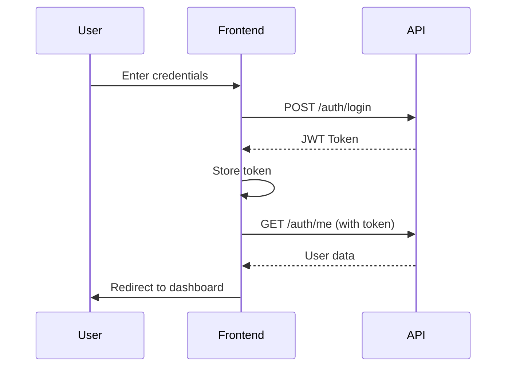

# BizConnect - Business Contact Management System

<div align="center">
  
  
  [](https://reactjs.org/)
  [](https://www.typescriptlang.org/)
  [](https://vitejs.dev/)
  [](https://tailwindcss.com/)
  [](LICENSE)

  <p align="center">
    A modern, full-featured business contact management system
    <br />
    <a href="#features"><strong>Explore Features »</strong></a>
    <br />
    <br />
    <a href="#demo">View Demo</a>
    ·
    <a href="https://github.com/yourusername/bizconnect/issues">Report Bug</a>
    ·
    <a href="https://github.com/yourusername/bizconnect/issues">Request Feature</a>
  </p>
</div>

---

## 📋 Table of Contents

- [About](#about)
- [Features](#features)
- [Technology Stack](#technology-stack)
- [Getting Started](#getting-started)
- [Project Structure](#project-structure)
- [API Integration](#api-integration)
- [Usage Guide](#usage-guide)
- [Deployment](#deployment)
- [Contributing](#contributing)
- [License](#license)
- [Contact](#contact)

---

## 🎯 About

**BizConnect** is a comprehensive business contact management system designed to help professionals, entrepreneurs, and businesses efficiently organize and maintain their network of contacts, clients, and partners. With powerful features like smart tagging, automated reminders, and digital business cards, BizConnect streamlines relationship management and helps you stay connected with what matters most.

### Why BizConnect?

- **🚀 Modern & Fast**: Built with cutting-edge technologies for optimal performance
- **📱 Responsive Design**: Works seamlessly across all devices
- **🎨 Beautiful UI**: Intuitive interface with smooth animations
- **🔒 Secure**: Enterprise-grade security with JWT authentication
- **📊 Insightful**: Comprehensive dashboard with actionable insights
- **🔄 Import/Export**: Easy data migration with Excel/CSV support

---

## ✨ Features

### Core Features

#### 👥 Contact Management
- **CRUD Operations**: Create, read, update, and delete contacts with ease
- **Advanced Search**: Search by name, email, company, or phone number
- **Smart Filtering**: Filter contacts by tags, creation date, or custom criteria
- **Bulk Operations**: Import/export contacts via Excel or CSV
- **Rich Profiles**: Store comprehensive contact information including:
  - Personal details (name, email, phone)
  - Professional info (job title, company)
  - Social links (LinkedIn, website)
  - Custom notes
  - Full address (Country → State → City)

#### 🏷️ Smart Tagging System
- Create unlimited custom tags
- Assign multiple tags to contacts
- Filter contacts by single or multiple tags
- View contact count per tag
- Bulk tag operations
- Tag-based contact grouping

#### ⏰ Reminder Management
- Set follow-up reminders for contacts
- Multiple contacts per reminder support
- Flexible scheduling with date/time picker
- Status tracking (Pending, Done, Skipped, Cancelled)
- Overdue reminder notifications
- Bulk reminder operations
- Primary contact designation

#### 🔔 Smart Notifications
- Real-time notification system
- Categorized notifications (unread, read, upcoming, past)
- In-app notification center
- Direct navigation to related contacts/reminders
- Bulk mark as read
- Notification history

#### 📇 Digital Business Card
- Create personalized digital business card
- Public sharing with unique URL
- View count tracking
- QR code integration (coming soon)
- Link to company profile
- Customizable visibility (public/private)
- Professional card design

#### 🏢 Company Profile Management
- Comprehensive company information
- Logo upload support
- Business address management
- Company-wide settings
- Contact linking to company

#### 📊 Analytics Dashboard
- Contact statistics overview
- Active reminders count
- Recent activity feed
- Partnership growth metrics
- Quick action shortcuts
- Visual data representation

### Additional Features

- **🔐 Authentication System**
  - Secure registration and login
  - Email verification
  - Password reset with OTP
  - Session management
  - Remember me functionality

- **🌍 Location Management**
  - Hierarchical address system (Country → State → City)
  - International support
  - Auto-populated location dropdowns

- **📤 Data Management**
  - Excel import with template
  - CSV export with custom fields
  - Bulk data operations
  - Data validation

- **🎨 User Experience**
  - Smooth page transitions
  - Loading state indicators
  - Toast notifications
  - Empty state designs
  - Error handling
  - Mobile-optimized interface

---

## 🚀 Technology Stack

### Frontend
| Technology | Purpose |
|------------|---------|
| React 18.x | UI Library with latest features |
| TypeScript 5.x | Type-safe development |
| Vite 5.x | Lightning-fast build tool |
| TailwindCSS 3.x | Utility-first CSS framework |
| React Router v6 | Client-side routing |
| Redux Toolkit | State management |
| Framer Motion | Smooth animations |
| Lucide React | Beautiful icon set |
| Axios | HTTP client |

### Backend Integration
- RESTful API architecture
- JWT token authentication
- Laravel backend (separate repository)
- Real-time notifications

### Development Tools
- ESLint for code quality
- Prettier for code formatting
- TypeScript for type checking
- Git for version control

---

## 🏁 Getting Started

### Prerequisites

Before you begin, ensure you have the following installed:
- **Node.js** (v18.x or higher) - [Download](https://nodejs.org/)
- **npm** (v9.x or higher) or **yarn** (v1.22.x or higher)
- **Git** - [Download](https://git-scm.com/)

### Installation

1. **Clone the repository**
```bash
   git clone https://github.com/yourusername/bizconnect.git
   cd bizconnect
```

2. **Install dependencies**
```bash
   npm install
   # or if you prefer yarn
   yarn install
```

3. **Set up environment variables**
   
   Create a `.env` file in the root directory:
```bash
   cp .env.example .env
```

   Edit the `.env` file with your configuration:
```env
   VITE_API_BASE_URL=http://localhost:8000/api
```

4. **Start the development server**
```bash
   npm run dev
   # or
   yarn dev
```

   The application will be available at `http://localhost:5173`

5. **Build for production** (optional)
```bash
   npm run build
   # or
   yarn build
```

   The production-ready files will be in the `dist/` directory.

### Quick Start Commands
```bash
# Development
npm run dev          # Start dev server
npm run build        # Build for production
npm run preview      # Preview production build

# Code Quality
npm run lint         # Run ESLint
npm run format       # Format code with Prettier
npm run type-check   # Run TypeScript checks

# Testing
npm run test         # Run tests
npm run test:watch   # Run tests in watch mode
npm run test:coverage # Generate coverage report
```

---

## 🗂️ Project Structure
```
bizconnect/
├── public/                 # Static assets
│   ├── bizzconnect.png    # Logo
│   └── config.js          # Runtime config
├── src/
│   ├── components/        # React components
│   │   ├── auth/         # Authentication components
│   │   │   ├── LoginForm.tsx
│   │   │   ├── SignupForm.tsx
│   │   │   └── ForgotForm.tsx
│   │   ├── contacts/     # Contact management
│   │   │   ├── ContactList.tsx
│   │   │   ├── ContactCard.tsx
│   │   │   ├── ContactDetail.tsx
│   │   │   ├── EditContactSheet.tsx
│   │   │   ├── ImportContactsModal.tsx
│   │   │   └── ExportContactsModal.tsx
│   │   ├── reminders/    # Reminder components
│   │   │   ├── ReminderTable.tsx
│   │   │   ├── ReminderFormModal.tsx
│   │   │   └── ReminderFilters.tsx
│   │   ├── tags/         # Tag management
│   │   │   ├── TagEditModal.tsx
│   │   │   └── TagContactsDrawer.tsx
│   │   ├── settings/     # Settings components
│   │   │   ├── BusinessCardSettings.tsx
│   │   │   ├── CompanySettings.tsx
│   │   │   └── CountrySelect.tsx
│   │   ├── ui/           # Reusable UI components
│   │   │   ├── Toast.tsx
│   │   │   └── Pagination.tsx
│   │   └── AppNav.tsx    # Main navigation
│   ├── features/         # Redux slices
│   │   └── auth/
│   │       └── authSlice.ts
│   ├── hooks/            # Custom React hooks
│   │   ├── useDebounced.ts
│   │   └── useMediaQuery.ts
│   ├── lib/              # Utility libraries
│   │   ├── api.ts        # API helper functions
│   │   └── config.ts     # App configuration
│   ├── pages/            # Page components
│   │   ├── AuthPortal.tsx
│   │   ├── Dashboard.tsx
│   │   ├── Contacts.tsx
│   │   ├── Tags.tsx
│   │   ├── Reminders.tsx
│   │   ├── Notifications.tsx
│   │   ├── Setting.tsx
│   │   └── NotFound.tsx
│   ├── services/         # API services
│   │   ├── api.ts        # Axios instance
│   │   ├── auth.ts       # Auth API
│   │   ├── contacts.ts   # Contacts API
│   │   ├── reminders.ts  # Reminders API
│   │   ├── tags.ts       # Tags API
│   │   ├── notifications.ts
│   │   ├── businessCard.ts
│   │   ├── company.ts
│   │   └── location.ts
│   ├── store.ts          # Redux store
│   ├── App.tsx           # Root component
│   ├── main.tsx          # Entry point
│   └── index.css         # Global styles
├── .env.example          # Environment template
├── .eslintrc.json        # ESLint config
├── .prettierrc           # Prettier config
├── tsconfig.json         # TypeScript config
├── vite.config.ts        # Vite config
├── tailwind.config.js    # Tailwind config
├── package.json          # Dependencies
└── README.md            # This file
```

---

## 📡 API Integration

### API Configuration

The application communicates with a Laravel backend API. Configure the API base URL in your `.env` file:
```env
VITE_API_BASE_URL=http://localhost:8000/api
```

### Authentication Flow


### Main API Endpoints

#### Authentication
| Method | Endpoint | Description | Auth Required |
|--------|----------|-------------|---------------|
| POST | /auth/register | Register new user | No |
| POST | /auth/login | User login | No |
| GET | /auth/me | Get current user | Yes |
| POST | /auth/logout | User logout | Yes |
| POST | /email/verification-notification | Resend verification email | Yes |
| POST | /auth/password/request | Request password reset | No |
| POST | /auth/password/verify | Verify reset code | No |

#### Contacts
| Method | Endpoint | Description | Auth Required |
|--------|----------|-------------|---------------|
| GET | /contacts | List all contacts | Yes |
| POST | /contacts | Create new contact | Yes |
| GET | /contacts/{id} | Get contact details | Yes |
| PUT | /contacts/{id} | Update contact | Yes |
| DELETE | /contacts/{id} | Delete contact | Yes |
| GET | /contacts/export | Export contacts | Yes |
| POST | /contacts/import | Import contacts | Yes |
| GET | /contacts/export-template | Download template | Yes |

#### Tags
| Method | Endpoint | Description | Auth Required |
|--------|----------|-------------|---------------|
| GET | /tags | List all tags | Yes |
| POST | /tags | Create new tag | Yes |
| PUT | /tags/{id} | Update tag | Yes |
| DELETE | /tags/{id} | Delete tag | Yes |
| POST | /contacts/{id}/tags | Attach tags to contact | Yes |
| DELETE | /contacts/{contactId}/tags/{tagId} | Detach tag | Yes |

#### Reminders
| Method | Endpoint | Description | Auth Required |
|--------|----------|-------------|---------------|
| GET | /reminders | List reminders | Yes |
| POST | /reminders | Create reminder | Yes |
| GET | /reminders/{id} | Get reminder details | Yes |
| PATCH | /reminders/{id} | Update reminder | Yes |
| DELETE | /reminders/{id} | Delete reminder | Yes |
| POST | /reminders/{id}/done | Mark as done | Yes |
| POST | /reminders/bulk-status | Bulk status update | Yes |
| POST | /reminders/bulk-delete | Bulk delete | Yes |
| GET | /reminders/pivot | List reminder-contact edges | Yes |

#### Notifications
| Method | Endpoint | Description | Auth Required |
|--------|----------|-------------|---------------|
| GET | /notifications | List notifications | Yes |
| POST | /notifications/{id}/read | Mark as read | Yes |
| POST | /notifications/bulk-read | Bulk mark as read | Yes |
| DELETE | /notifications/{id} | Delete notification | Yes |

#### Business Card
| Method | Endpoint | Description | Auth Required |
|--------|----------|-------------|---------------|
| GET | /business-card | Get user's card | Yes |
| POST | /business-card | Create/update card | Yes |
| DELETE | /business-card | Delete card | Yes |
| GET | /business-card/public/{slug} | View public card | No |

#### Company
| Method | Endpoint | Description | Auth Required |
|--------|----------|-------------|---------------|
| GET | /company | Get user's company | Yes |
| POST | /company | Create/update company | Yes |
| DELETE | /company | Delete company | Yes |

#### Location
| Method | Endpoint | Description | Auth Required |
|--------|----------|-------------|---------------|
| GET | /countries | List countries | Yes |
| GET | /countries/{code}/states | List states | Yes |
| GET | /states/{code}/cities | List cities | Yes |

### Request/Response Examples

#### Login Request
```javascript
POST /auth/login
Content-Type: application/json

{
  "email": "user@example.com",
  "password": "password123"
}
```

#### Login Response
```javascript
{
  "token": "eyJ0eXAiOiJKV1QiLCJhbGc...",
  "user": {
    "id": 1,
    "name": "John Doe",
    "email": "user@example.com",
    "email_verified_at": "2024-01-01T00:00:00.000000Z"
  },
  "verified": true
}
```

#### Create Contact Request
```javascript
POST /contacts
Authorization: Bearer {token}
Content-Type: application/json

{
  "name": "Jane Smith",
  "email": "jane@example.com",
  "phone": "+1234567890",
  "company": "Tech Corp",
  "job_title": "Software Engineer",
  "notes": "Met at conference",
  "linkedin_url": "https://linkedin.com/in/janesmith",
  "address_detail": "123 Main St",
  "country": "US",
  "state": "CA",
  "city": "SF"
}
```

---

## 📖 Usage Guide

### Getting Started with BizConnect

#### 1. Account Setup
1. Navigate to the application
2. Click "Create account" on the auth page
3. Fill in your details (name, email, password)
4. Verify your email through the verification link sent
5. Complete your profile in Settings

#### 2. Adding Your First Contact
1. Go to the Contacts page
2. Click the "New" button
3. Fill in contact information:
   - Required: Name
   - Optional: Email, phone, company, job title, notes, social links, address
4. Add relevant tags for easy filtering
5. Click "Save"

#### 3. Organizing with Tags
1. Navigate to the Tags page
2. Click "New Tag"
3. Enter a tag name (e.g., "Client", "Partner", "Warm Lead")
4. Assign tags to contacts from the contact detail page
5. Filter contacts by tags on the Contacts page

#### 4. Setting Up Reminders
1. Go to the Reminders page
2. Click "New Reminder"
3. Select one or more contacts
4. Set a title and optional note
5. Choose a due date and time
6. Save the reminder
7. Receive notifications when reminders are due

#### 5. Creating Your Business Card
1. Navigate to Settings
2. Scroll to the Business Card section
3. Fill in your professional details
4. Upload a profile photo (optional)
5. Toggle "Make card public" to enable sharing
6. Copy your unique card URL to share with others

#### 6. Import/Export Contacts
**Importing:**
1. Download the template from the Import modal
2. Fill in your contact data
3. Upload the file
4. Choose match criteria (by ID, email, or phone)
5. Review the import summary

**Exporting:**
1. Apply filters/search if needed
2. Click "Export"
3. Choose format (Excel or CSV)
4. Select export scope (all, current page, or selected)
5. Download the file

### Tips & Best Practices

- **Use Tags Strategically**: Create tags that align with your business processes (e.g., Lead Stage, Industry, Priority)
- **Set Regular Reminders**: Schedule follow-ups to maintain relationships
- **Keep Notes Updated**: Add context to each interaction for better tracking
- **Utilize Search**: Use the powerful search to quickly find contacts
- **Regular Backups**: Export your contacts periodically as backup
- **Clean Data**: Remove duplicate or outdated contacts regularly

---

## 🚢 Deployment

### Build for Production
```bash
npm run build
```

This creates an optimized production build in the `dist/` directory.

### Deploy to Vercel

1. Install Vercel CLI:
```bash
   npm install -g vercel
```

2. Deploy:
```bash
   vercel --prod
```

3. Set environment variables in Vercel dashboard:
   - `VITE_API_BASE_URL`: Your production API URL

### Deploy to Netlify

1. Install Netlify CLI:
```bash
   npm install -g netlify-cli
```

2. Build the project:
```bash
   npm run build
```

3. Deploy:
```bash
   netlify deploy --prod --dir=dist
```

4. Set environment variables in Netlify dashboard

### Deploy to AWS S3 + CloudFront

1. Build the project:
```bash
   npm run build
```

2. Upload `dist/` contents to S3 bucket

3. Configure CloudFront distribution

4. Set up Route53 for custom domain

### Environment Variables for Production
```env
VITE_API_BASE_URL=https://api.yourdomain.com/api
```

### Performance Optimization

The production build includes:
- Code splitting
- Tree shaking
- Minification
- Gzip compression
- Image optimization
- Lazy loading

---

## 🧪 Testing

### Running Tests
```bash
# Run all tests
npm run test

# Run tests in watch mode
npm run test:watch

# Generate coverage report
npm run test:coverage

# Run E2E tests
npm run test:e2e
```

### Test Structure
```
src/
├── components/
│   └── __tests__/
│       ├── ContactCard.test.tsx
│       └── LoginForm.test.tsx
├── services/
│   └── __tests__/
│       └── api.test.ts
└── hooks/
    └── __tests__/
        └── useDebounced.test.ts
```

### Writing Tests

Example test for a component:
```typescript
import { render, screen } from '@testing-library/react';
import ContactCard from '../ContactCard';

describe('ContactCard', () => {
  it('renders contact name', () => {
    const contact = {
      id: 1,
      name: 'John Doe',
      email: 'john@example.com'
    };
    
    render(<ContactCard contact={contact} />);
    expect(screen.getByText('John Doe')).toBeInTheDocument();
  });
});
```

---

## 🤝 Contributing

We love contributions! Here's how you can help make BizConnect better:

### How to Contribute

1. **Fork the repository**
```bash
   git clone https://github.com/yourusername/bizconnect.git
```

2. **Create a feature branch**
```bash
   git checkout -b feature/AmazingFeature
```

3. **Make your changes**
   - Write clean, documented code
   - Follow the existing code style
   - Add tests for new features
   - Update documentation as needed

4. **Commit your changes**
```bash
   git commit -m 'Add some AmazingFeature'
```

5. **Push to your branch**
```bash
   git push origin feature/AmazingFeature
```

6. **Open a Pull Request**
   - Describe your changes clearly
   - Reference any related issues
   - Wait for review and feedback

### Coding Guidelines

- **TypeScript**: Use TypeScript for all new code
- **Components**: Create reusable, single-purpose components
- **Styling**: Use TailwindCSS utility classes
- **State Management**: Use Redux for global state, React hooks for local state
- **API Calls**: Use the service layer, don't call APIs directly in components
- **Error Handling**: Always handle errors gracefully with user-friendly messages
- **Accessibility**: Ensure all interactive elements are keyboard accessible

### Code Style

- Follow ESLint and Prettier configurations
- Use meaningful variable and function names
- Write self-documenting code
- Add comments for complex logic
- Keep functions small and focused

### Pull Request Checklist

- [ ] Code follows project style guidelines
- [ ] Tests added/updated and passing
- [ ] Documentation updated
- [ ] No console errors or warnings
- [ ] Responsive design tested
- [ ] Accessibility checked
- [ ] Performance impact considered

---

## 🐛 Bug Reports

Found a bug? Please open an issue with:
- Clear description of the problem
- Steps to reproduce
- Expected vs actual behavior
- Screenshots (if applicable)
- Browser/device information

---

## 💡 Feature Requests

Have an idea? We'd love to hear it! Open an issue with:
- Clear description of the feature
- Use case and benefits
- Proposed implementation (if any)

---

## 📝 License

This project is licensed under the MIT License - see the [LICENSE](LICENSE) file for details.
```
MIT License

Copyright (c) 2024 BizConnect

Permission is hereby granted, free of charge, to any person obtaining a copy
of this software and associated documentation files (the "Software"), to deal
in the Software without restriction, including without limitation the rights
to use, copy, modify, merge, publish, distribute, sublicense, and/or sell
copies of the Software, and to permit persons to whom the Software is
furnished to do so, subject to the following conditions:

The above copyright notice and this permission notice shall be included in all
copies or substantial portions of the Software.

THE SOFTWARE IS PROVIDED "AS IS", WITHOUT WARRANTY OF ANY KIND, EXPRESS OR
IMPLIED, INCLUDING BUT NOT LIMITED TO THE WARRANTIES OF MERCHANTABILITY,
FITNESS FOR A PARTICULAR PURPOSE AND NONINFRINGEMENT. IN NO EVENT SHALL THE
AUTHORS OR COPYRIGHT HOLDERS BE LIABLE FOR ANY CLAIM, DAMAGES OR OTHER
LIABILITY, WHETHER IN AN ACTION OF CONTRACT, TORT OR OTHERWISE, ARISING FROM,
OUT OF OR IN CONNECTION WITH THE SOFTWARE OR THE USE OR OTHER DEALINGS IN THE
SOFTWARE.
```

---

## 👥 Team

- **Lead Developer**: [Your Name](https://github.com/yourusername)
- **UI/UX Designer**: [Designer Name]
- **Backend Developer**: [Backend Dev Name]
- **Project Manager**: [PM Name]

---

## 📧 Contact & Support

### Get in Touch

- **Email**: support@bizconnect.com
- **Website**: [www.bizconnect.com](https://www.bizconnect.com)
- **GitHub Issues**: [Report a bug](https://github.com/yourusername/bizconnect/issues)
- **GitHub Discussions**: [Ask a question](https://github.com/yourusername/bizconnect/discussions)
- **Twitter**: [@bizconnect](https://twitter.com/bizconnect)
- **LinkedIn**: [BizConnect](https://linkedin.com/company/bizconnect)

### Support

- 📚 **Documentation**: [Wiki](https://github.com/yourusername/bizconnect/wiki)
- 💬 **Community**: [Discord Server](https://discord.gg/bizconnect)
- ❓ **FAQ**: [Frequently Asked Questions](https://github.com/yourusername/bizconnect/wiki/FAQ)

---

## 🙏 Acknowledgments

Special thanks to:

- [React Team](https://reactjs.org/) for the amazing framework
- [Vite](https://vitejs.dev/) for the blazing-fast build tool
- [TailwindCSS](https://tailwindcss.com/) for the utility-first CSS framework
- [Lucide](https://lucide.dev/) for the beautiful icons
- [Framer Motion](https://www.framer.com/motion/) for smooth animations
- [Laravel](https://laravel.com/) for the robust backend framework
- All our contributors and supporters

---

## 🗺️ Roadmap

### Version 1.1 (Q1 2024)
- [ ] Dark mode support
- [ ] Multi-language support (i18n)
- [ ] Advanced filtering options
- [ ] Contact merge functionality
- [ ] Duplicate detection

### Version 1.2 (Q2 2024)
- [ ] Calendar integration (Google Calendar, Outlook)
- [ ] Email integration (Gmail, Outlook)
- [ ] Contact groups/lists
- [ ] Custom fields for contacts
- [ ] Activity timeline

### Version 2.0 (Q3 2024)
- [ ] Mobile app (React Native)
- [ ] Team collaboration features
- [ ] Advanced analytics dashboard
- [ ] WhatsApp integration
- [ ] Telegram integration
- [ ] AI-powered contact suggestions
- [ ] Automated follow-up recommendations

### Version 2.1 (Q4 2024)
- [ ] Video call integration
- [ ] Voice notes for contacts
- [ ] Advanced reporting
- [ ] Export to PDF with templates
- [ ] Contact scoring system

### Future Considerations
- [ ] CRM integration (Salesforce, HubSpot)
- [ ] API for third-party integrations
- [ ] Zapier integration
- [ ] Browser extension
- [ ] Desktop app (Electron)

---

## 📊 Project Stats


---

## 🌟 Star History

[](https://star-history.com/#yourusername/bizconnect&Date)

---

## 📈 Performance Metrics

- **Lighthouse Score**: 95+ (Performance, Accessibility, Best Practices, SEO)
- **Bundle Size**: ~200KB gzipped
- **First Contentful Paint**: <1.5s
- **Time to Interactive**: <2.5s
- **Total Blocking Time**: <200ms

---

## 🔒 Security

### Reporting Security Issues

If you discover a security vulnerability, please email security@bizconnect.com instead of using the issue tracker.

### Security Features

- JWT token-based authentication
- XSS protection
- CSRF protection
- Rate limiting
- Input sanitization
- Secure password hashing (bcrypt)
- HTTPS enforced in production
- Regular security audits

---

## 🌐 Browser Support

| Browser | Version |
|---------|---------|
| Chrome | Latest 2 versions ✅ |
| Firefox | Latest 2 versions ✅ |
| Safari | Latest 2 versions ✅ |
| Edge | Latest 2 versions ✅ |
| Opera | Latest 2 versions ✅ |

### Mobile Support

- iOS Safari 14+ ✅
- Android Chrome 90+ ✅
- Samsung Internet 14+ ✅

---

## 📱 Screenshots

### Dashboard
<div align="center">
  
  <p><em>Main dashboard with statistics, recent activities, and quick actions</em></p>
</div>

### Contacts Management
<div align="center">
  
  <p><em>Contact list with advanced search, filtering, and bulk operations</em></p>
</div>

### Contact Details
<div align="center">
  
  <p><em>Comprehensive contact information with tags and actions</em></p>
</div>

### Reminders
<div align="center">
  
  <p><em>Reminder management with status tracking and filtering</em></p>
</div>

### Tags Management
<div align="center">
  
  <p><em>Tag overview with contact counts and management options</em></p>
</div>

### Digital Business Card
<div align="center">
  
  <p><em>Professional digital business card with sharing capabilities</em></p>
</div>

### Mobile Responsive
<div align="center">
  
  <p><em>Fully responsive design optimized for mobile devices</em></p>
</div>

---

## 📚 Additional Resources

- **Video Tutorial**: [Getting Started with BizConnect](https://youtube.com/watch?v=demo)
- **Blog**: [Best Practices for Contact Management](https://blog.bizconnect.com)
- **API Documentation**: [API Reference](https://api.bizconnect.com/docs)
- **Change Log**: [CHANGELOG.md](CHANGELOG.md)

---

<div align="center">
  <p>
    <strong>Made with ❤️ by the BizConnect Team</strong>
  </p>
  <p>
    ⭐ If you find this project useful, please consider giving it a star!
  </p>
  <p>
    <a href="#bizconnect---business-contact-management-system">Back to Top ↑</a>
  </p>
</div>
